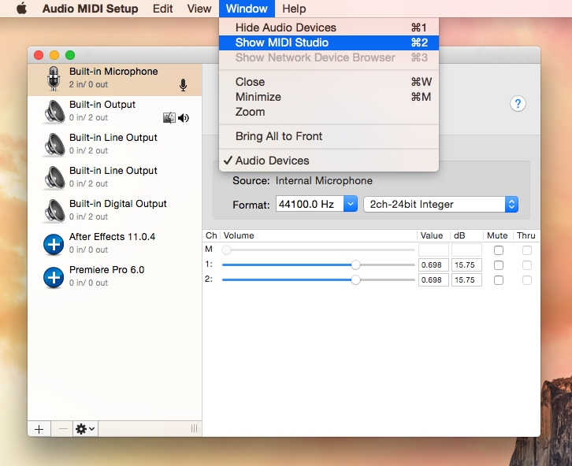
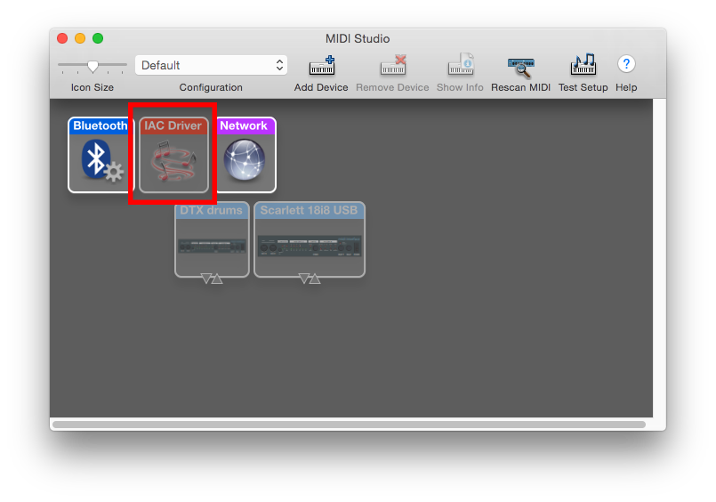
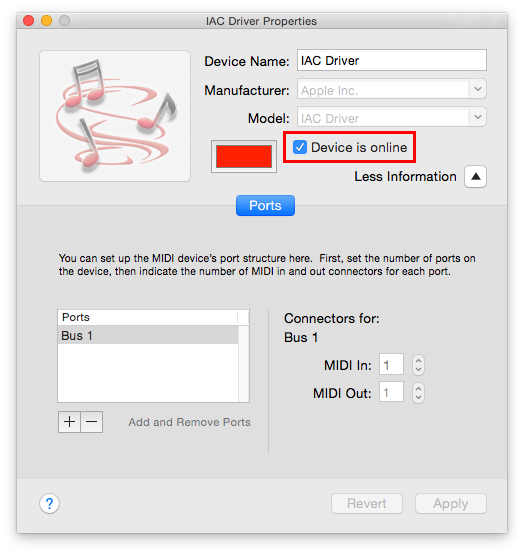
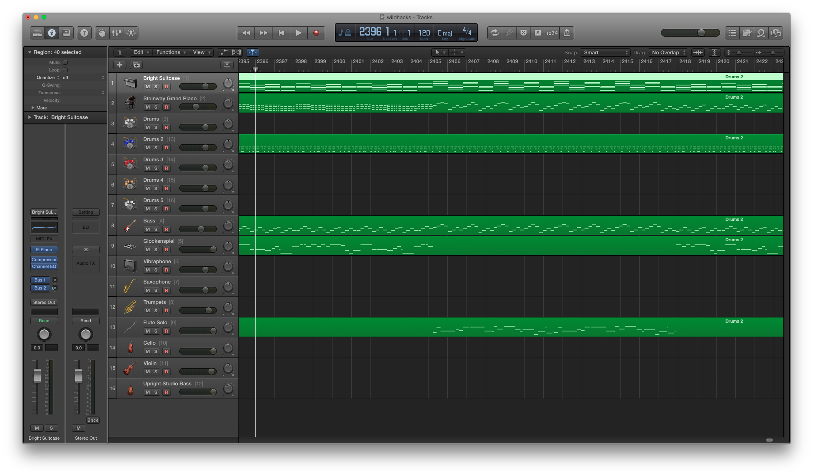
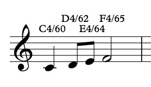

# muse

Inspired by our lack of actual musical talent, Muse produces MIDI streams with
procedurally generated music. Our approach to procedurally generated music is
quite simple, yet quite effective. With this project, we attempted to obtain the best results with the simplest algorithms.

To listen to samples generated by Muse, please visit https://soundcloud.com/ryan-eberhardt-1/sets/procedural-music-generation-demo/s-0cKVO

Uses
----

Procedurally-generated music has many potential applications. For many, music
helps to drown out distractions and focus on the task at hand, but lyrics are
distracting in their own right; this could be used to generate a wide selection
of lyric-less music. It could be used to generate royalty-free background music
for videos, or to create a catchy ad jingle. Muse could also be used to
generate backing tracks to practice playing instruments to (disable the drum
track and practice creating your own beats, or disable the melody track and
practice playing along with a melodic instrument). Some even expressed interest
in generating tunes to freestyle rap to.

Setup
-----

So far, this project has only been tested in a Mac environment using Logic Pro to synthesize the MIDI stream into an audio stream.

### mido and portmidi

This project uses the `mido` Python library, which depends on `portmidi` (although it can also use other backends). Install using pip and homebrew:

```
brew install portmidi
virtualenv env             # virtualenv is recommended but not required
source env/bin/activate    # ^
pip install mido
```

### Creating virtual MIDI device

We will create a virtual MIDI device for muse to output to; a corresponding input device will be created for Logic to play from. Open Audio MIDI Setup from Spotlight or (from Finder) Go > Utilities > Audio MIDI Setup. Open MIDI Studio from the Window menu:



Inside the MIDI Studio, double click the IAC Driver icon:



Then check "Device is online" to enable the virtual MIDI device:



### MIDI mappings

We use Logic Pro to synthesize the MIDI stream into an audio stream, but any DAW would work for this purpose. Our MIDI mappings are as follows:

* Channel 1: Bright Suitcase (vintage electric piano, for playing the chords in the chord progression)
* Ch 2: Grand piano (arpeggiates the notes in each chord)
* Ch 3: Drum kit 1
* Ch 4: Bass (arpeggiates the notes in each chord)
* Ch 5: Glockenspiel
* Ch 6: Vibraphone
* Ch 7: Saxophone
* Ch 8: Trumpet
* Ch 9: Flute
* Ch 10: Cello
* Ch 11: Violin
* Ch 12: Upright bass (arpeggiates the notes in each chord)
* Ch 13: Drum kit 2
* Ch 14: Drum kit 3
* Ch 15: Drum kit 4
* Ch 16: Drum kit 5



How it works
------------

### Sequencing of notes

In order to more easily construct the MIDI streams for multiple instruments, we implemented a highly rudimentary note sequencing system. Each note is represented as a tuple containing the MIDI note number for the note, the velocity, and the duration (as a fraction of a measure). For example, a quarter note at C4 with MIDI velocity 80 would be represented as `(60, 80, 0.25)`. Notes are then sequenced as lists of tuples. Each "slot" in the list is like an eigth-note slot; the first item in the list will be played on the downbeat of 1, the second item will be played on the "and" of 1, the third item will be played on the downbeat of 2, the fourth item will be played on the "and" of 2, and so on. Notes can last longer than eigth notes (as defined in the tuple representing the note), but the position in the list defines the position within a measure (in terms of eigth notes) where the note should be started. If no note starts on a particular eigth-note position, that position in the list should be filled with `None`. For example, the following measure would be represented as `[(60, 80, 0.25), None, (62, 80, 0.125), (64, 80, 0.125), (65, 80, 0.5), None, None, None]`:



Once sequences of notes are generated for all the instruments, the program will then progress through the song, eigth note by eigth note, playing the note at the current position in all the instruments' note lists over the appropriate MIDI channel.

### Song structure

All of the songs generated are based on 4-bar chord progressions. Two progressions are generated -- one for the verse, and one for the chorus. The verse progression is played 4 times (producing 16 measures, which are represented as lists of 128 eigth-note "slots", as described above), and then the chorus progression is played 4 times (another 16 measures), and then the verse progression is repeated. Obviously, much more variability could be introduced with respect to the structure of generated songs, but this was a good starting point for us.

### Chord progressions, piano, bass

We generate 4-bar chord progressions with a bit of music theory taken from http://www.angelfire.com/music/HarpOn/theory2.html. The diagram in the "Diatonic Triads" is a graph representing common chord progressions. We implemented this graph as an adjacency list so that given any diatonic triad, we could randomly pick a diatonic triad to harmoniously transition to. We pick a random chord to start with, and then randomly walk the graph for an additional 3 chords to create the progression.

The chord progressions are sequenced for three instruments. A "vintage electric piano" plays the chords as whole notes, and a grand piano and bass instrument (electric bass or double bass, randomly selected) arpeggiate the notes in the chord (an octave apart).

### Rhythm

For each section of the song (verse or chorus) we generate a measure of drums and repeat it for the duration of the section (playing fills and introducing more variation would be nice in the future). We start by placing a snare drum note on beats 2 and 4 of a measure, as is typical with rock beats. We then fill in the rest of the measure with random "ghost notes" (snare drum notes of a much lower MIDI velocity). Bass drum notes are also added in random positions. The program will randomly decide whether or not to use the hi-hat; if it elects to play it, it will add hi-hat eigth-notes throughout the measure, where downbeats have a higher velocity than upbeats in order to add a more "human" feel. This strategy is extremely simple, yet the beats it produces feel quite real and provide for great variation.

Drums are instrumented using Logic Pro with one of five sampled drum kits. The program will randomly pick one of the five MIDI drum channels to send the sequenced drum track over.

### Melody

Generating melodies was by far the most difficult component of this project, as quality melodies cannot be generated with a simple set of rules as can chord progressions and drum beats. The approach we came up with leaves much room for improvement, but is still able to generate decent melodies if run several times.

For each chord in the chord progression, the program enumerates "chord tones"
-- notes that comprise the chord -- and "non-chord tones" -- notes that are
outside of the chord. Chord tones create harmony, but their overuse leads to
simple, boring melodies; non-chord tones create dissonance, but used sparingly,
can be used to add variation and keep a listener on his/her toes. We randomly
select a starting note with a bias towards chord tones (which have a 91% chance
of being selected). Subsequent notes are semi-randomly selected with (again) a
bias towards chord tones and towards notes that are nearby the note that was
previously played, in order to create continuity and avoid jumping all over the
scale. Note lengths are semi-randomly selected as well, with a bias towards
quarter notes and against dotted half notes and whole notes.

The melody is instrumented using one of seven instruments (glockenspiel, vibraphone, saxophone, trumpet, flute, cello, or violin). The instrumentation can vary between the verse and the chorus.

### Tempo, key, and swing feel

A tempo is randomly chosen between 100bpm and 200bpm. A random key is also selected. The program randomly decides whether to play the song with a swing feel (as opposed to playing in straight time). If the swing feel is enabled, each pair of eigth notes will be played with durations 0.167 and 0.083 (2/3 * 0.25 and 1/3 * 0.25) as opposed to 0.125 and 0.125. Playing eigth notes in this way creates a "triplet" or "swing" feel.

Future improvements
-------------------

### Improved melodies

The current simplistic approach to generating melodies could be further improved by generating a short melody (e.g. 4 bars) and then mutating it or repeating it in order to create a strong motif that makes the song stick in a listener's memory. More complex algorithms could also be introduced for melody generation, such as markov trains or recurrent neural networks trained on existing songs; however, we wanted to test the quality of the results we could obtain with a simple algorithm and no training data.

### More melodic instruments

Multiple melodic instruments could be introduced that interact with the primary
melodic instrument by doubling the melody in a different rangeœ, harmonizing, or playing a countermelody.

### Graphical interface

Currently, many paramters control the generated song (such as tempo, frequency ghost notes are played, bias towards chord tones in melodies, bias towards certain note lengths, swing feel, etc) but these parameters are all randomly selected. Eventually, we would like to add a graphical interface for a user to control these parameters and tweak a generated song for his/her liking. We also want to add the ability to regenerate certain parts of a song (e.g. if the melody sounds great but the drum part feels off, we would be able to regenerate the drum part with new parameters).

### Variations in song structure

As mentioned, the program currently follows a simple verse-chorus-verse pattern, with 16 measures each. Introducing variation here could greatly increase the variation in the songs produced.

### Improved percussion

The drum parts could be improved by generating fills between phrases in a song (e.g. between the verse and chorus, or between a melody repeat, etc). We also want to have the program play in half-time or double-time in places, which would further increase variation in the feel of produced songs.
